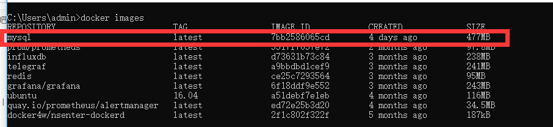
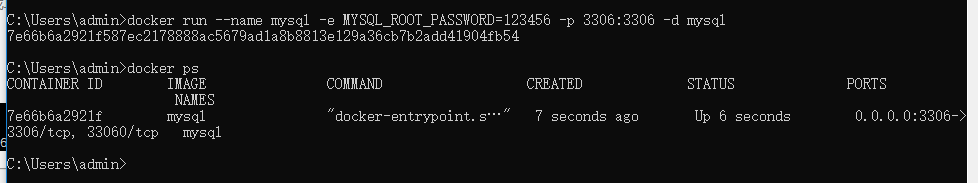
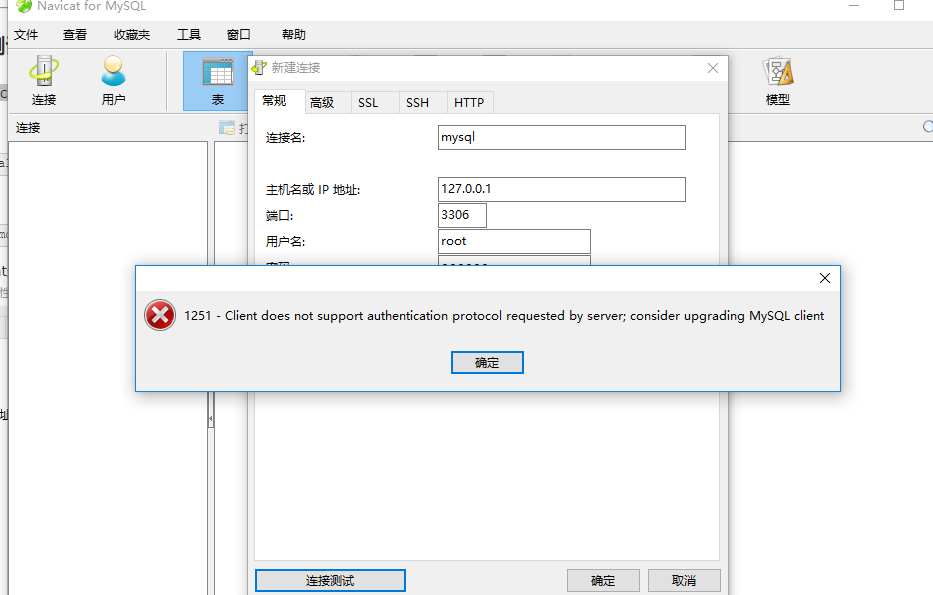
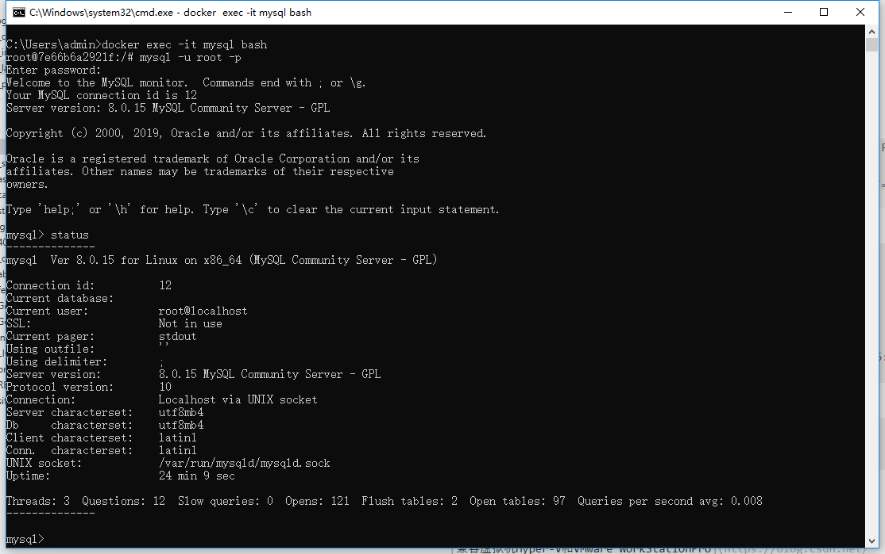
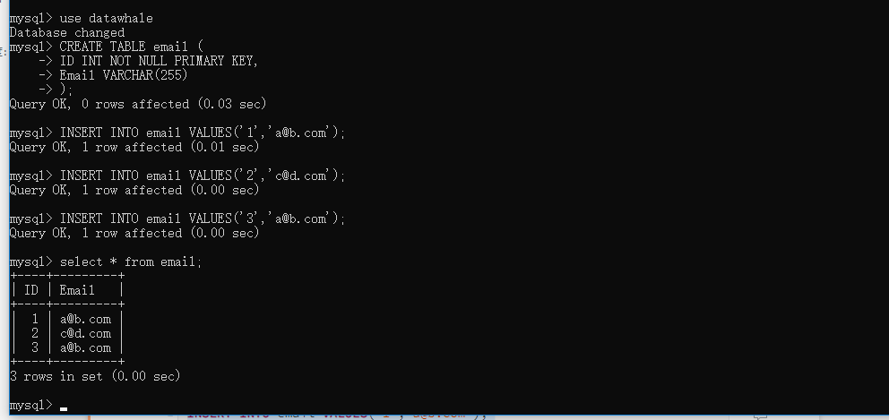
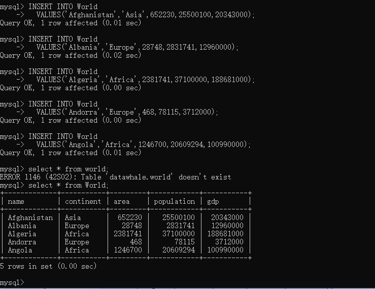
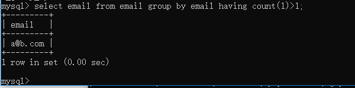
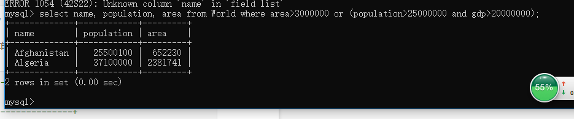

#MySQL环境配置
	win10系统安装虽然自带了Hyper-V虚拟机，但是会与VmWare WorkStation Pro冲突
	想用docker安装Mysql却不想再创建个虚拟机，只能解决冲突了。
	百度了下开启内核隔离的内存完整性可以解决了冲突，副作用是开机似乎很卡。
***

##Docker安装步骤：
1.拉取Mysql镜像 `docker pull mysql`
    (吐槽下)确实比较慢

2.查看镜像 `docker images`

3.创建Mysql容器 `docker run --name mysql -e MYSQL_ROOT_PASSWORD=123456 -p 3306:3306 -d mysql`

##Mysql连接
1.命令行方式 `docker exec -it mysql bash`

2.Navicat连接Native连接报错，提示1251，原因：Mysql版本太新(8.0),

#常用命令
1、查看mysql状态 `status`
    
2、创建DB `create database datawhale;`

3.使用DB `user datawhale;`

4.导入SQL脚本 `source ./*.sql`

#作业
##初始化环境

##项目一：查找重复的电子邮箱
    1、使用group by语句
    `select email from email group by email having count(1)>1;`

##项目二：查找大国
    `select name,population,area
    from World
    where area>3000000 or (population>25000000 and gdp>20000000)`

#总结
1.表名区分大小写，字段不区分

2.查询需先确定需要的查询字段，不要查询所有字段

#参考资料
[兼容虚拟机Hyper-V和VMware WorkStationPro](https://blog.csdn.net/weixin_42453659/article/details/81172770)

[Docker安装mysql](https://www.cnblogs.com/pwc1996/p/5425234.html)

[Navicat 远程连接docker容器中的mysql 报错1251](https://blog.csdn.net/sinat_38345188/article/details/80838098)